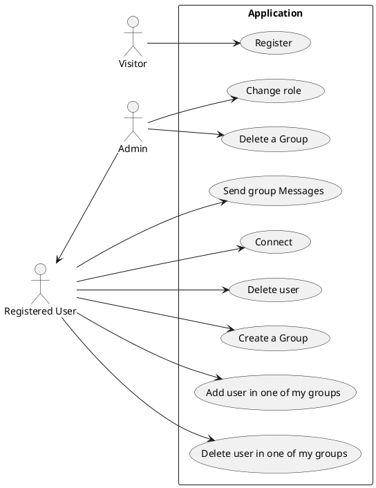
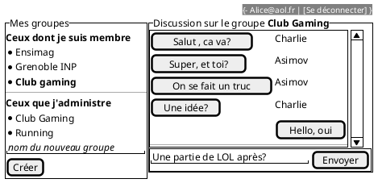
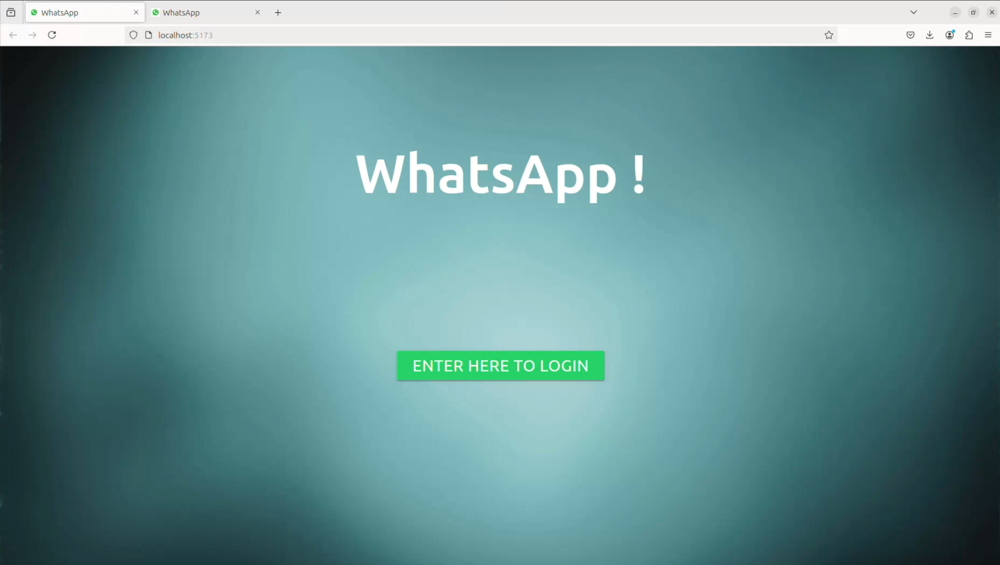
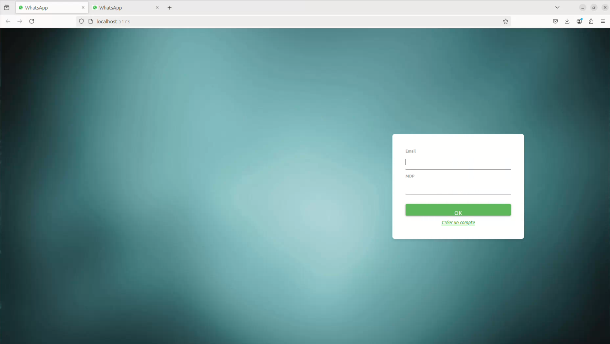
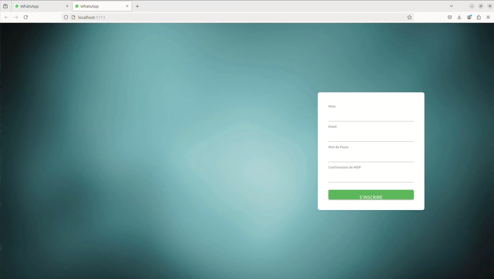
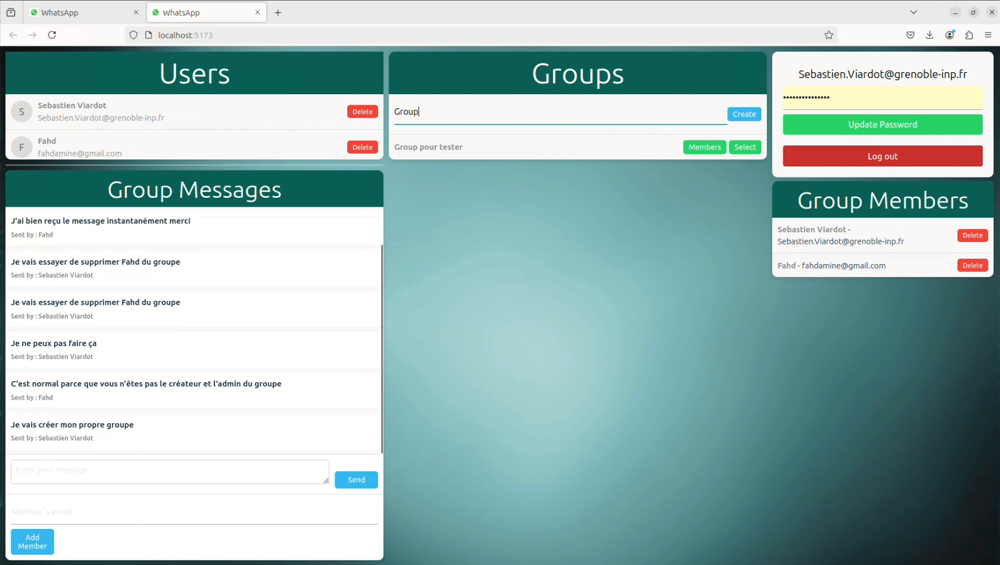
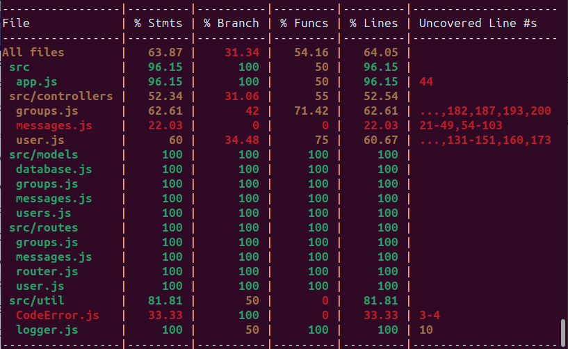

---
title: Projet React 
author:  
- deltahdf
--- 

### Cas d'usage




### Maquettes



### Captures d'écran

*Interface principale - Bouton "Enter here to Login Page"*



*Interface de Login"*


*Création d'un compte"*


*interface du site"*


Ce screen montre un exemple de l'affichage de la liste des users

### API mise en place

Donner le lien vers la documentation swagger et/ou faire un tableau récapitulant l'API

Tableau récapitulatif de l'API
| Méthode | Endpoint                        | Description                           |
|---------|---------------------------------|---------------------------------------|
| GET     | /api/groups                     | Récupérer tous les groupes           |
| POST    | /api/groups                     | Créer un nouveau groupe              |
| GET     | /api/groups/:groupId            | Récupérer les membres d'un groupe    |
| POST    | /api/groups/:groupId/:userId   | Ajouter un membre à un groupe        |
| DELETE  | /api/groups/:groupId/:userId   | Supprimer un membre d'un groupe      |
| GET     | /api/messages/:groupId         | Récupérer les messages d'un groupe   |
| POST    | /api/messages/:groupId         | Envoyer un message à un groupe       |
| POST    | /login                          | Authentification de l'utilisateur    |
| GET     | /api/users                      | Récupérer tous les utilisateurs      |
| POST    | /api/users                      | Créer un nouvel utilisateur          |
| POST    | /api/users/:id                  | Mettre à jour le mot de passe d'un utilisateur |
| DELETE  | /api/users/:id                  | Supprimer un utilisateur             |


## Architecture du code

### FrontEnd

Pour notre frontend, voici l'organisation de notre code :

frontend/

├── logos/ # fichier des images utilisés

│ └── public/ #fichier contenant l'image svg

│
├── src/

│ ├── Components/

    ├──── GroupList.jsx

    ├──── GroupList.css

    ├──── GroupMembers.jsx

    ├──── GroupMembers.css

    ├──── GroupMessages.jsx

    ├──── GroupMessages.css

    ├──── Options.jsx

    ├──── Options.css

    ├──── UserList.jsx

    ├──── UserList.css

│ ├── App.jsx

│ │── App2.jsx

│ │── home.css

│ │── index.css

│ │── Login.css

│ │── Login.jsx #La page de Login

│ │── main.jsx #Notre main

│ │── Page.jsx # Fichier qui gére la page principale

│ │── Signup.css

│ │── Signup.jsx #Fichier qui gére l'interface de l'enregistrement


### Backend

#### Schéma de votre base de donnée

```plantuml
class User{
  name
  email
  passhash
  isAdmin : boolean
}

class Message{
  content
  id #id du message
  gid #id du group dont le message appartient
  uid: #id du user qui a envoyer le message
}

class Group{
id 
  name
  ownerId
}

User "1" -- "n" Message : posts
Group "1" -- "n" Message : contains

User "n" -- "n"  Group : is member 
User "1" -- "n"  Group : create and own
```

#### Architecture de votre code

Dans le backend, l'organisation du code suit une structure modulaire, avec des répertoires distincts pour les contrôleurs, les modèles, les routes et les utilitaires.

Contrôleurs (controllers) : Les fichiers de contrôleurs sont situés dans le répertoire src/controllers/. Chaque fichier correspond à une entité spécifique ou à un ensemble de fonctionnalités liées. Par exemple, les contrôleurs groups.js, messages.js et user.js gèrent respectivement les opérations liées aux groupes, aux messages et aux utilisateurs.

Modèles (models) : Les définitions de modèles sont stockées dans le répertoire src/models/. Ces fichiers définissent la structure de la base de données à l'aide de Sequelize, un ORM pour Node.js. Les modèles database.js, groups.js, messages.js et users.js définissent les schémas des différentes entités de la base de données.

Routes : Les routes de l'API sont définies dans le répertoire src/routes/. Chaque fichier de route correspond à un ensemble spécifique de points de terminaison de l'API. Par exemple, les fichiers groups.js, messages.js et user.js définissent les routes associées aux opérations de groupe, de message et d'utilisateur respectivement.

Tests : Les tests sont situés dans le répertoire _tests_/. Le fichier api.global.test.js contient les tests globaux pour l'API, couvrant les fonctionnalités principales et les scénarios d'utilisation.


├── backend

│   ├── src/

│   │   ├── controllers/

│   │   │   ├── groups.js

│   │   │   ├── messages.js

│   │   │   └── user.js

│   │   ├── models/

│   │   │   ├── database.js

│   │   │   ├── groups.js

│   │   │   ├── messages.js

│   │   │   └── users.js

│   │   ├── routes/

│   │   │   ├── groups.js

│   │   │   ├── messages.js

│   │   │   ├── router.js

│   │   │   └── user.js

│   │   └── util/

│   │       ├── CodeError.js

│   │       ├── logger.js

│   │       ├── swagger.js

│   │       └── updatedb.js

├── frontend/

│   ├── src/

│   │   └── index.html

└── _tests_/

    └── api.global.test.js


### Gestion des rôles et droits

Expliquer ici les différents rôles mis en place, et comment ils sont gérés dans votre code.

Utilisateur standard: Un utilisateur standard peut accéder aux fonctionnalités de base de l'application, telles que la visualisation des messages et la création de nouveaux messages dans les groupes auxquels il appartient.

Administrateur: Un administrateur a des privilèges supplémentaires, tels que la gestion des utilisateurs, la création de groupes, suppression des users,et la suppression de messages.

- Coté backend: Dans le backend de notre application, nous avons mis en place un système de gestion des rôles pour contrôler les actions autorisées en fonction du niveau d'accès de l'utilisateur


- Coté frontend:
la gestion des rôles est principalement axée sur l'interface utilisateur. Les fonctionnalités spécifiques aux administrateurs, telles que la gestion des utilisateurs et des groupes, sont uniquement accessibles aux utilisateurs ayant le rôle d'administrateur.


## Test


Au niveau du backend, nous avons réalisé des tests unitaires pour valider le bon fonctionnement de nos fonctionnalités, en particulier pour les contrôleurs et les routes. Voici les tests que nous avons effectués :

- Authentification et gestion des utilisateurs:

- Test de connexion utilisateur avec des informations correctes.
Test de création d'un nouvel utilisateur.
- Test de vérification que l'utilisateur ne peut pas s'inscrire avec un e-mail déjà existant.
- Test de vérification que l'utilisateur ne peut pas se connecter avec des informations incorrectes.
- Test de mise à jour du mot de passe utilisateur.
Gestion des groupes:

- Test de création d'un nouveau groupe.
- Test d'ajout d'un membre à un groupe.
- Test de suppression d'un membre d'un groupe.
- Test de récupération de la liste des membres d'un groupe.
Gestion des messages:

- Test de récupération de la liste des messages d'un groupe.

- Test d'envoi d'un message à un groupe.

Ces tests sont conçus pour s'assurer que les différentes fonctionnalités de notre backend fonctionnent comme prévu et que les autorisations sont correctement appliquées.


*Couverture des tests"*

En plus de ces Tests, on a utilisé Cypress pour détecter les différents bugs présents dans l'application du coté frontend et backend, 
les Tests Cypress sont dans le fichier cypress/e2e/Tests.cy.js
On a pas mis plus de Tests cypress vu que la plupart des bugs détectés dans l'application ont été découvert en manipulation au sain de cypress.


## Intégration + déploiement (1/3)

En ce qui concerne le déploiement, je n'ai pas été en mesure de le faire à travers Scalingo.

## Installation
Dans /frontend:  
npm Install  
npm install antd  
npm install materialize-css@next  

Dans /backend:  
npm install swagger-autogen  
npm install nodemon 
